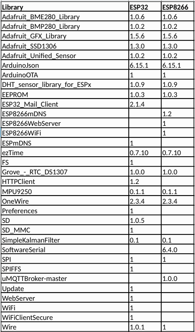

# RFLink-ESP V3.2

This is a fork of RFLink, build for the ESP8266 and the ESP32.
The previous versions (2.1 ... 2.4) have been proven to be stable, running 24/7 for over 2 years without any problem.
Version V3.0 is a complete rebuild, based on my standard Sensor/Receiver libraries, which is easier to maintain and opens the possibility to easy add new features.
I believe that one or more of the forks has a better RF detection.

If all build flags are enabled, to include as much libraries as possible, the following libraries are needed:


V3.2

- added Email on (re-)start (at the moment this only works for ESP32). Although by a call to Restart_Email (as shown in the main program) also a (re-)start email for the ESP8266 can be send
- added warning MQTT message on (re-)start
- added username/password to MQTTconnection (may be left empty)

V3.1 of RFLink-ESP has the following new or improved features

- complete rebuild on the base of Sensors/Receivers-concept (more features with less effort)
- program can be completely build and controlled by WebSettings
- simultanuous support of serial and telnet debug and control
- OTA suport
- Webserver for settings and download of files
- received and transmitted messages are stored in a file
- build flags extended, so the program can be used with a minimal set of libraries
- flag Home_Automation removed
- command added: 19;PRINT; //lists the known devices
- Learning_Mode=9 is made asynchronuous, so you can do other things including stopping LM-9
- command added: 13; and 14; // shows/sets 2 commands for Learning_Mode 8/9
- programs added to upload files to the ESP by FTP

## Secrets

To change settings and store private keys, create a `secrets.h` file under `src/`. Below is a sample of basic required secrets.

```cpp
// ***********************************************************************
//  PRIVATE GLOBALS
// ***********************************************************************
#define __SECRET_Wifi_Name "Home Network SSID"
#define __SECRET_Wifi_PWD "Password"
#define __SECRET_Broker_IP "192.168.22.23"

#define __SECRET_SMTP_Server "smtp.gmail.com"
#ifdef ESP32
#define __SECRET_SMTP_Port 587
#else
#define __SECRET_SMTP_Port 465
#endif
#define __SECRET_SMTP_User "someone@gmail.com"
#define __SECRET_SMTP_PWD "someones password"
#define __SECRET_SMTP_MailTo "someone@gmail.com"
```

## Schmurtz

forked V2.1 and made it more compatible with other Bridge-libraries. https://github.com/schmurtzm/RFLink-ESP

## RFLink-ESP V2.1

Home Assistant / Domoticz tested with a RFLink, modified for ESP8266 and ESP32

This is a fork of RFLink, and because we couldn't get it working reliable, we ended up in a complete rewrite of RFLink.
Problem is that the latest version of RFLink is R48. We couldn't only find sources of version R29 and R35. Both sources didn't work correctly, R29 was the best. We tried to contact "the stuntteam" which owns the orginal sources but no response.

This version of RFLink-ESP has the following features

- just a few protocols are translated and tested
- Protocols are more generic, so you need less protocols
- Protocols are written as classes and all derived from a common class
- Protocols can easily be selected and the order can be determined
- Debugmode replaced with a more flexible Learning_Mode
- Removed a lot of redundancies
- Device must be registered before they will be recognized ( (almost) no more false postives)
- Dynamically determine long/short puls, by measuring Min,Max,Mean
- Runs on ESP32 and even on a ESP8266
- Fully open source
- Codesize is strongly reduced
- Can communicate over USB/RS232 or MQTT

Some ideas for the future

- Implementing rolling code SomFy / Own
- Cleanup global constants and variables
- Using SI4432 as Receiver / Transmitter (Transmitter can be used for all frequencies, Receiver might be able to fetch a complete sequence, so listening at more frequencies at the same time might even be possible)
- Logging of false positives, including time (Neighbours ??) NTP: https://www.instructables.com/id/Arduino-Internet-Time-Client/
